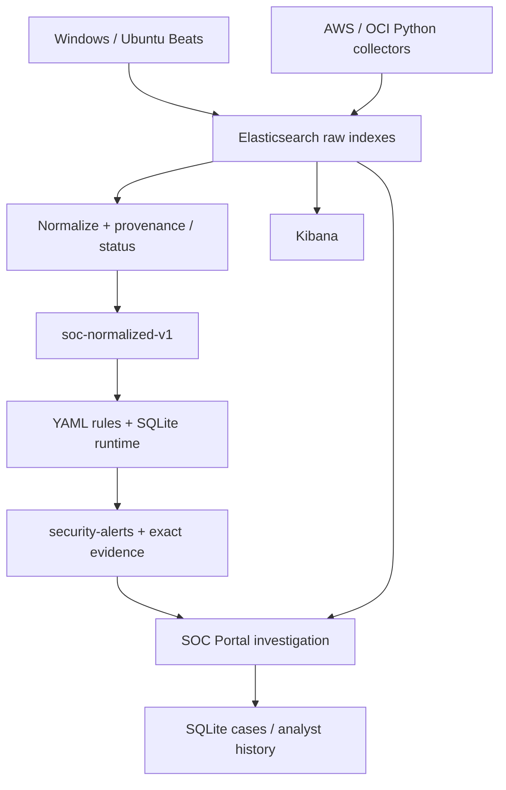
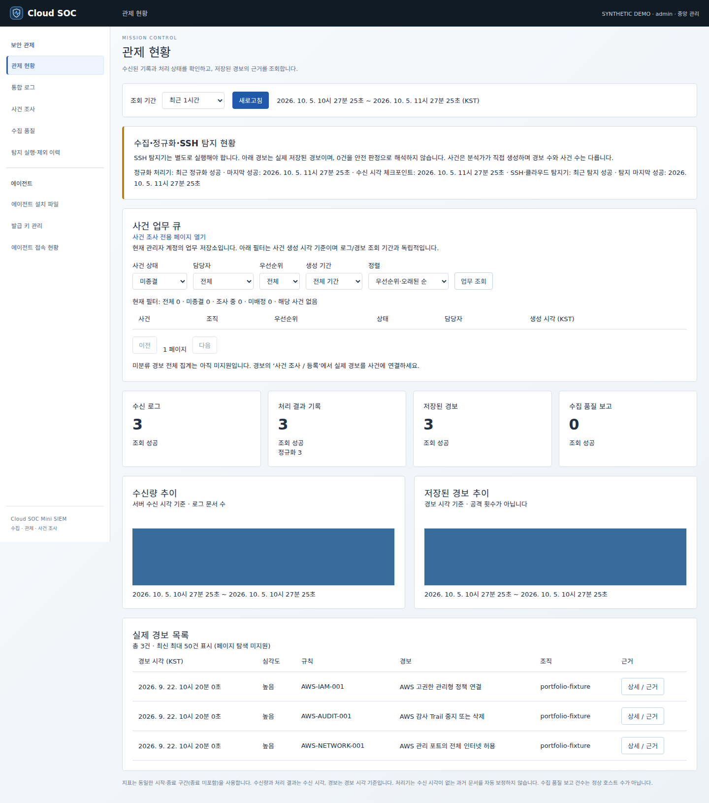
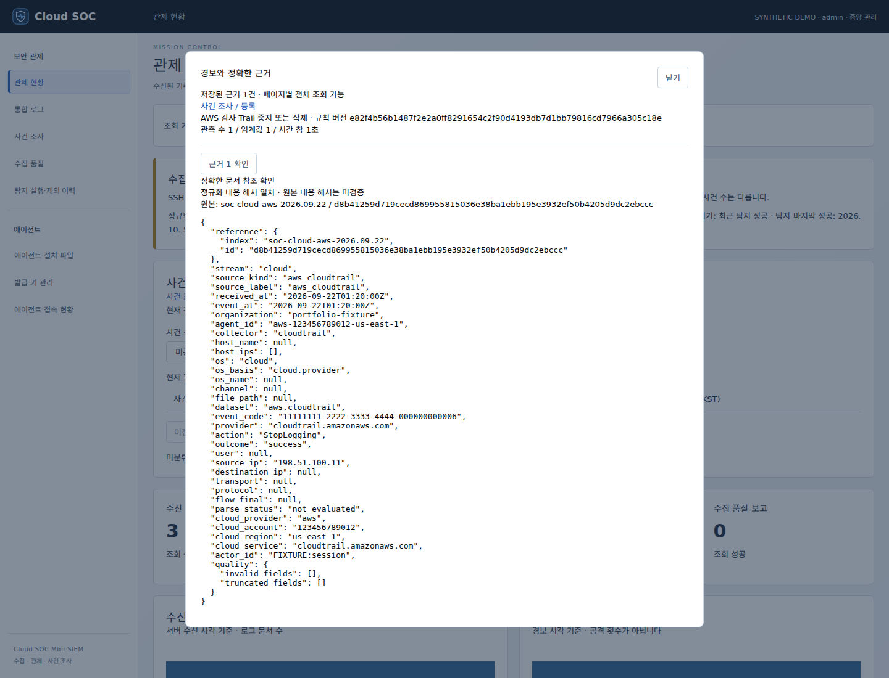
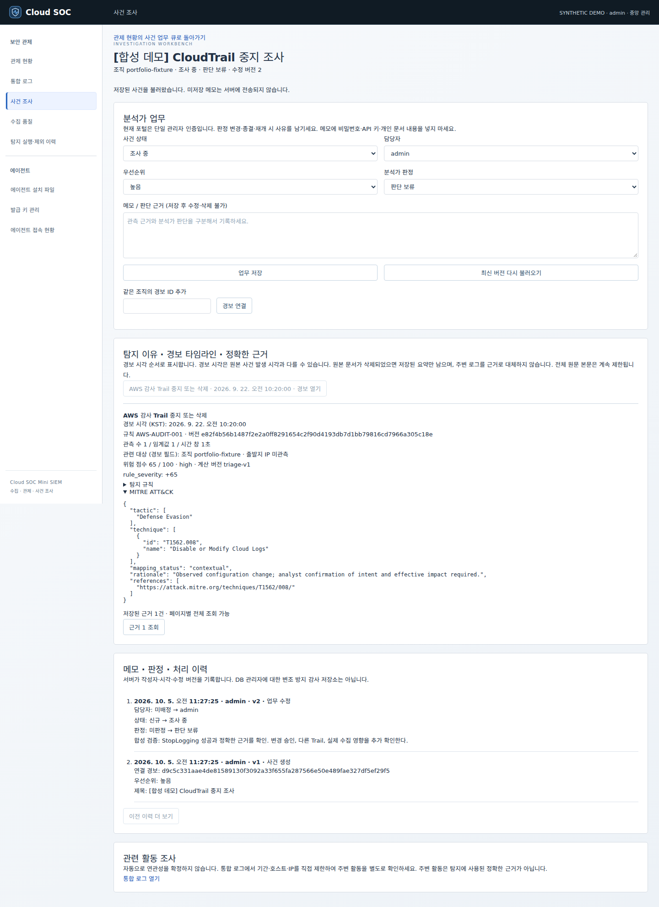

# Cloud SOC

**Cloud-native Mini SIEM & Detection Engineering Platform**

Windows·Ubuntu·AWS·OCI의 서로 다른 보안 로그를 공통 스키마로 정규화하고, YAML 규칙으로 탐지한 경보에서 **정확한 근거 문서와 사건 조사**까지 연결하는 보안관제 프로젝트입니다.

[](https://github.com/Gandalem/cloud-soc/actions/workflows/ci.yaml)


> Coverage는 2026-10-05 로컬 오프라인 측정 스냅샷입니다. 새 Windows matrix의 원격 실행 결과는 Actions에서 확인하세요.

## 왜 만들었나요?

로그마다 필드와 의미가 달라 수집량만으로 보안 상태를 판단하기 어렵습니다. 이 프로젝트는 **다종 로그 정규화, 재처리 시 중복 방지, 탐지 근거 추적, 수집 실패와 미관측 구분**을 하나의 조사 흐름으로 묶습니다. 경보는 조사할 행위이며 공격 성공 판정이나 자동 차단을 의미하지 않습니다.

## 핵심 구현

| 역량 | 구현과 확인 근거 |
| --- | --- |
| 다종 로그 처리 | Windows/Linux, AWS CloudTrail, OCI Audit; 공통 필드와 지원/실패 상태 분리 |
| Detection-as-Code | YAML threshold/single/sequence 6개 규칙; cloud/sequence는 opt-in |
| 신뢰성 | SQLite 시간 창·cooldown·checkpoint, replay-safe create-only 경보, 부분 조회/쓰기 실패 시험 |
| 증적 추적 | raw/normalized index+ID, 정규화 내용 해시, 규칙 snapshot/version, 페이지별 근거 조회 |
| SOC 업무 | 관제 현황 → 경보 상세 → 사건 등록 → 담당자·상태·판정·메모 이력 |
| 보안 설계 | TLS, 최소 권한 API 키, 구조화 민감정보 제거, 선택 세션 RBAC/CSRF |
| 품질 자동화 | Ruff, pytest/coverage, Node UI, Bandit, pip-audit, Compose 검증, Docker build |

[아키텍처 상세](docs/portfolio/architecture.md) · [3개 재현 데모](docs/portfolio/demo.md) · [MITRE 매핑](docs/portfolio/mitre.md) · [품질·성능 측정](docs/portfolio/measurements.md) · [설치·운영](docs/installation.md)

## Architecture



Raw 인덱스는 수집기에서 민감정보를 제거한 자료입니다. Packetbeat 네트워크 메타데이터 전체가 현재 6개 탐지 규칙의 대상으로 정규화되는 것은 아닙니다. [지원 범위](docs/portfolio/architecture.md)

## Demo screens

실제 프로젝트 UI에 **합성 로그와 실제 탐지 결과**를 넣어 캡처했습니다. 운영 서버·실제 공격 캡처와 구분합니다. 사건 등록은 임시 SQLite를 사용합니다.



| 경보 상세 | 사건 조사 |
| --- | --- |
|  |  |

[캡처 재현 방법](docs/portfolio/screenshots.md)

## Attack → Detection → Investigation

| 합성 공격 행위 | 관측 이벤트 | 실제 Rule / Severity | 분석가 확인 |
| --- | --- | --- | --- |
| 고권한 정책 연결 | `AttachUserPolicy` + AdministratorAccess | AWS-IAM-001 / high | 변경 승인·대상 계정·실제 유효 권한 |
| 감사 로그 중지 | `StopLogging` 성공 | AWS-AUDIT-001 / high | Trail 상태·다른 Trail·실제 수집 영향 |
| 인터넷에 SSH 허용 | `AuthorizeSecurityGroupIngress`, TCP 22, `0.0.0.0/0` | AWS-NETWORK-001 / high | SG·라우팅·자산·승인 변경 여부 |

```bash
python -m pip install -c constraints.txt -r requirements-dev.txt
python tools/portfolio_eval.py --events 10000 --repeats 3
python tools/portfolio_preview.py
# http://127.0.0.1:8770/index.html — 합성 자료 전용
```

세 데모는 실제 projection → normalization → detection → alert build를 실행합니다. 데모 서버는 loopback 전용이며 Elasticsearch나 AWS 자원을 변경하지 않습니다. [상세 단계](docs/portfolio/demo.md)

## Testing & measurements

2026-10-05 Linux / Python 3.12.14 오프라인 기준:

- Python **417 passed / 5 skipped / 154 subtests passed**, statement coverage **88.5%**.
- AWS 규칙 3개, 라벨 사례 **17개**: TP 7 / TN 10 / FP 0 / FN 0. 이 작은 합성 집합의 precision/recall 100%는 운영 탐지 정확도를 뜻하지 않습니다.
- 10,000개 고유 StopLogging 이벤트, warmup 1회 + 측정 3회: 처리 중앙값 **5.451초**, 약 **1,835건/초**. 메모리 내 투영·정규화·탐지·경보 생성만 측정했고 ES 저장·네트워크는 제외했습니다.
- Linux CI는 전체 Python/UI·보안·Docker를 검사하며 Windows matrix는 선별 Python·에이전트 offline·PowerShell 구문을 검사합니다. 실제 Windows 서비스 설치/수신 검증과 구분합니다.

```bash
python -m pytest -q --cov=cloud_soc --cov-report=term-missing --cov-report=xml --cov-report=json
python tools/coverage_badge.py
```

[원시 측정과 한계](docs/portfolio/measurements.md) · [재현 JSON](docs/portfolio/evaluation.json)

## Tech stack & contribution evidence

Python 3.12 · Flask · Elasticsearch/Kibana · Filebeat/Packetbeat · SQLite · YAML · Docker Compose · Caddy · AWS/OCI SDK · GitHub Actions.

본 저장소는 수집, 파싱/정규화, 규칙 기반 탐지, 운영 포털, 에이전트 설치·복구, 회귀 시험의 구현 근거를 제공합니다. **개인 기여 범위는 실제 커밋·PR과 [작업 기록](docs/work_tracker.md)을 기준으로 설명하세요.** 공동 저장소 전체를 개인 단독 개발로 주장하지 않습니다.

면접에서 설명할 핵심: “탐지가 맞는지뿐 아니라 재시작·부분 실패·재처리에서 근거와 경보의 일관성을 어떻게 지키는지 검증했습니다.”

## Run & operation

신규 중앙 서버, 에이전트 설치, 기존 PC 갱신, 수신 확인, 장애 대응은 [설치·운영 가이드](docs/installation.md)에 보존했습니다. 기존 서버에 초기 설치기를 재실행하기 전에 갱신·백업 안내를 확인하세요.

개선 코드와 합성 검증은 운영 배포/실제 수신 완료와 구분합니다. 기존 runtime에 MITRE metadata가 추가된 규칙을 적용할 때는 규칙 버전 변경과 [증분 탐지 이행 안내](docs/incremental_detection.md)를 확인하세요.
