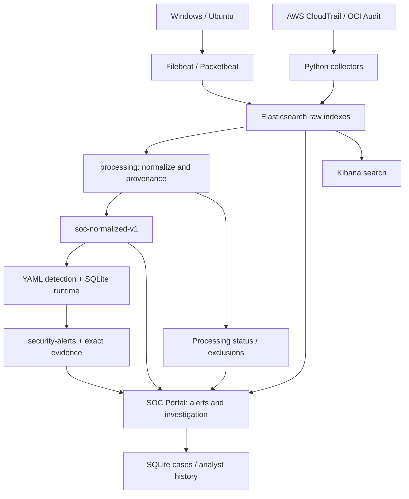

# Architecture

실제 소스 기준. Endpoint Beat는 Elasticsearch raw 인덱스로 직접 전송한다. AWS/OCI 수집기는 각각의 API 응답에서 허용한 메타데이터를 투영한다. 아래 Raw는 원문 전체 보존을 의미하지 않는다.

| 경계 | 코드 / 책임 |
| --- | --- |
| 수집 | `deploy/agents`, `src/cloud_soc/aws`, `src/cloud_soc/oci` |
| 정규화 | `src/cloud_soc/processing/contract.py`, `worker.py`: 지원/미지원/실패 구분 |
| 탐지 | `src/cloud_soc/detection`: threshold/single/sequence, opt-in cloud/sequence |
| 영속 상태 | SQLite checkpoint/window/cooldown; runtime 계약 변경은 새 상태/이행 검토 필요 |
| 증적 | raw/normalized index+ID와 정규화 내용 해시; create-only 경보 |
| 조사 | `src/cloud_soc/portal`: ES 조회 + SQLite 사건/메모/변경 이력 |
| 접근 | 중앙 Caddy TLS, 최소 권한 수집/조회 키, 관리자 인증/선택 세션 RBAC |

수집과 탐지는 비동기이므로 시각 지연·late exclusion·부분 검색·전송 실패를 별도 검사한다. 운영 ES 재시작/실수집 인수와 오프라인 시험은 구분한다.
